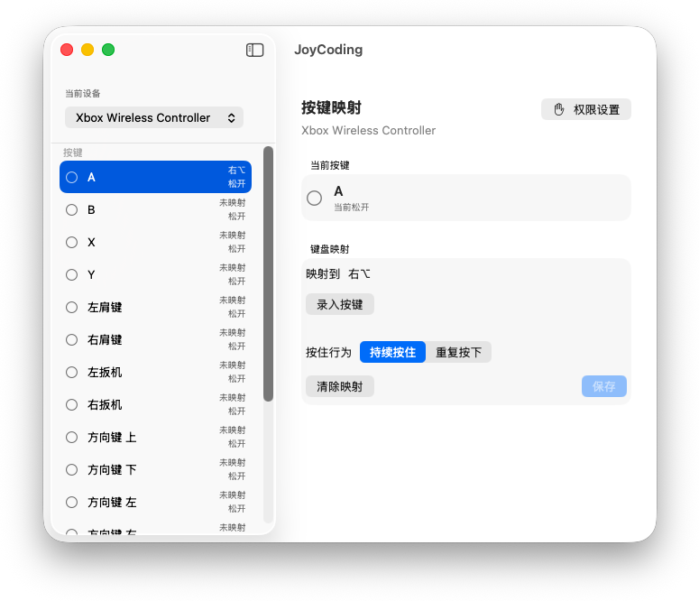

# JoyCoding

JoyCoding 是一个原生 macOS 菜单栏应用：把游戏手柄按键映射为键盘按键或快捷键，让手柄更自然地服务于游戏、演示、媒体控制和个人工作流。

> 需要 macOS 14 或更新版本，以及一台由系统 GameController 框架识别的手柄。



## 手柄兼容性

当前版本仅使用 Xbox 兼容手柄完成测试。其他由 macOS GameController 框架识别的手柄理论上也可能可用，但尚未经过完整验证；欢迎通过 Issue 告诉我们你的设备与使用结果。

## 功能

- 从菜单栏快速打开主窗口。
- 自动发现已连接手柄，显示实时按键状态。
- 为每个手柄按键录入单键或 Command、Option、Control、Shift 组合键。
- 选择“持续按住”或每 200 ms 一次的“重复按下”。
- 映射按手柄配置持久化；同一配置的手柄重新连接后自动恢复。
- 仅在点击“保存”后启用新映射，并可随时清除。
- 显示并引导配置所需的输入监控与辅助功能权限。

## 安装

从 [Releases](https://github.com/shiye515/JoyCoding/releases) 下载最新的 `JoyCoding-*.zip`，解压后将 `JoyCoding.app` 拖入“应用程序”。首次打开时，macOS 可能会提示确认开发者身份。

## 快速开始

1. 连接手柄并从菜单栏打开 JoyCoding。
2. 在左栏选择设备和手柄按键。
3. 在右栏点击“录入按键”，按下要映射的键或快捷键，例如 `⌘+K`。
4. 选择“持续按住”或“重复按下”，然后点击“保存”。
5. 点击右上角“权限设置”，授予辅助功能权限；否则映射会被保存但不会向其他应用发送键盘事件。

## 权限与隐私

JoyCoding 不读取、上传或分析你的键盘内容。键盘录入只在“录入按键”控件聚焦时在本应用内捕获；合成键盘事件仅用于执行你已保存的映射。所有映射都保存在本机 UserDefaults 中。

跨应用执行映射需要 macOS 的“辅助功能”权限。应用也会引导你配置输入监控权限，以确保手柄输入和系统权限状态可被正确识别。

## 从源码构建

使用 Xcode 打开 `JoyCoding.xcodeproj`，选择 `JoyCoding` scheme 后运行即可。项目没有第三方依赖。

```sh
xcodebuild -project JoyCoding.xcodeproj -scheme JoyCoding test
```

发布构建需要有效的 Developer ID Application 证书；未公证的构建在部分 macOS 配置下仍可能需要用户在系统设置中明确允许打开。

## 贡献与安全

JoyCoding 很欢迎社区贡献代码、修复问题、补充手柄兼容性测试或改进文档。欢迎提交 Issue 和 Pull Request；请先阅读 [贡献指南](CONTRIBUTING.md)。安全问题请遵循 [安全策略](SECURITY.md) 私下报告，不要在公开 Issue 中披露。

## 许可证

本项目以 [MIT License](LICENSE) 发布。
